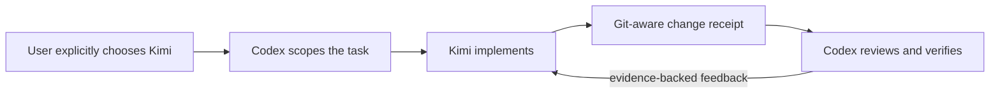

<div align="center">
  
  <h1>Kimi Partner</h1>
  <p><strong>Delegate to Kimi. Keep Codex in control.</strong></p>
  <p>
    An opt-in Codex plugin for handing a scoped coding task to Kimi Code,
    returning review feedback to the same session, and independently verifying the result.
  </p>
  <p>
    <a href="README.zh-CN.md">简体中文</a> ·
    <a href="https://github.com/jevonhou/kimi-partner/releases">Releases</a> ·
    <a href="SECURITY.md">Security</a>
  </p>
</div>

## Why Kimi Partner?

Different models are good at different things. Kimi Partner gives Codex users a deliberate way to try Kimi on a real local coding task without giving up orchestration, scope control, or final acceptance.



Kimi is an implementation partner here—not an automatic router and not the final reviewer.

## What it does

- **Opt-in delegation** — Kimi is used only when the user explicitly asks for it or approves it for the current task.
- **Persistent async tasks** — start a task, poll its state, and recover results across Codex task restarts.
- **Same-session review loop** — return Codex's evidence-backed feedback to the captured Kimi session.
- **Model continuity** — pin the model alias for every attempt; K3 sessions keep preserved thinking history.
- **Bounded execution** — allowed paths, dependency-install controls, external-path checks, dangerous Git-command checks, and a hard per-attempt timeout.
- **Git reconciliation** — changing `HEAD` or a file outside the allowed scope marks the task as failed.
- **Codex-owned acceptance** — Kimi's summary is evidence, not proof; Codex still inspects the diff and runs the relevant tests and browser checks.

## Tools

| Tool | Purpose |
| --- | --- |
| `start_kimi_task` | Start an explicitly approved, scoped Kimi coding task. |
| `get_kimi_task` | Read progress or wait briefly for state changes. |
| `continue_kimi_task` | Resume the same Kimi session with Codex review feedback. |
| `cancel_kimi_task` | Stop a verified active worker when the user asks. |

## Requirements

- macOS (the current process-group behavior is verified on macOS)
- Node.js 22 or newer
- [Kimi Code CLI](https://www.kimi.com/code) installed and signed in
- A Codex build with `codex plugin` support
- A target project inside a Git working tree

## Install

### Recommended: ask Codex

Paste this into Codex:

> Install the Kimi Partner plugin from https://github.com/jevonhou/kimi-partner. Clone it to `~/plugins/kimi-partner`, run its verification, register it in my personal Codex marketplace, install it, and confirm that its Skill and four MCP tools load.

This lets Codex inspect the repository shape, build the bundle, update the personal marketplace safely, and verify the installed copy.

### Manual installation

```bash
git clone https://github.com/jevonhou/kimi-partner.git ~/plugins/kimi-partner
cd ~/plugins/kimi-partner
npm ci
npm run verify
```

Add this entry to the `plugins` array in `~/.agents/plugins/marketplace.json` (preserve any existing entries):

```json
{
  "name": "kimi-partner",
  "source": {
    "source": "local",
    "path": "./plugins/kimi-partner"
  },
  "policy": {
    "installation": "AVAILABLE",
    "authentication": "ON_INSTALL"
  },
  "category": "Productivity"
}
```

Then install it from the marketplace name declared at the top of that file (normally `personal`):

```bash
codex plugin add kimi-partner@personal
```

Start a new Codex task afterward so the new Skill and MCP tools are loaded.

## Try it

Ask Codex:

> Let Kimi implement the button interaction states in this project, but only allow changes to `src/components/Button.tsx` and `src/styles/button.css`. Then review the diff and verify it yourself.

Codex should prepare the task, call Kimi Partner, wait for the result, inspect the Git receipt, and run its own acceptance checks.

## Safety model

Kimi Partner layers several controls:

1. Input paths are normalized against the real Git root, including symbolic-link escape checks.
2. The current model alias is captured and pinned across continuations.
3. K3 attempts set `KIMI_MODEL_THINKING_KEEP=all`.
4. Streamed tool calls are checked for out-of-scope writes, external absolute paths, unapproved dependency installs, and dangerous Git commands.
5. Every attempt has a hard runtime limit (30 minutes by default; configurable from 1–120 minutes).
6. Git state is reconciled after every attempt. Out-of-scope changes or a changed `HEAD` fail the task.

The streamed tool-call monitor is an **application-level guardrail, not an operating-system sandbox**. Codex must still inspect the final receipt and independently verify the work. See [SECURITY.md](SECURITY.md) for the full trust model.

## Development

```bash
npm ci
npm run verify
```

The runtime is bundled into `dist/mcp-server.mjs`; an installed plugin does not need its own `node_modules` at runtime.

## Project status

Kimi Partner is early-stage software. Version `0.1.x` is intended for local experimentation and careful review. macOS is the verified platform; Windows and Linux process-group semantics are not yet claimed.

## Unofficial project disclaimer

Kimi Partner is an independent community project. It is not affiliated with, endorsed by, or sponsored by OpenAI, Moonshot AI, or Kimi. Product names and trademarks belong to their respective owners.

## License

[MIT](LICENSE) © 2026 JeongHau
